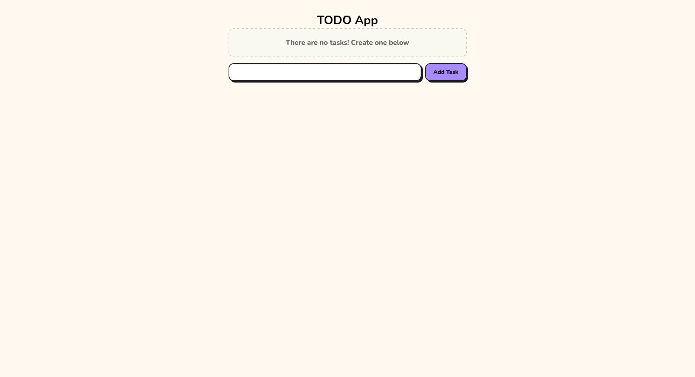
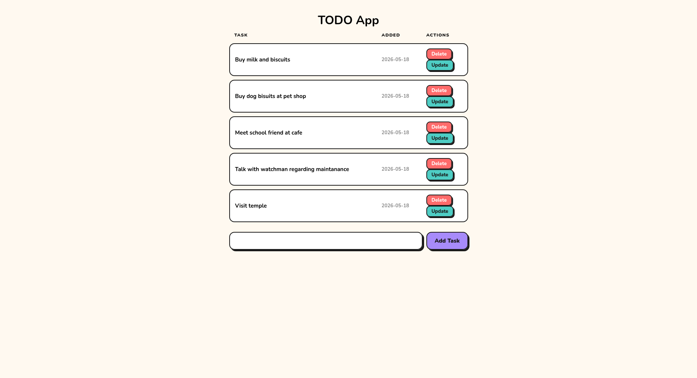

# Flask Todo App

My first dive into Flask — a simple todo app with full CRUD operations, routes, and Jinja2 templates.

## Screenshots




## What's in it

- Create, read, update, and delete tasks
- SQLite database for persistence
- Jinja2 templating
- Basic Flask routing

## Stack

- Python + Flask
- SQLite
- HTML/CSS
- Jinja2

## Run locally

```bash
pip install flask
python app.py
```

App runs locally on `http://localhost:5000`

App deployed at 'https://flask-todo-app-jhes.onrender.com/'